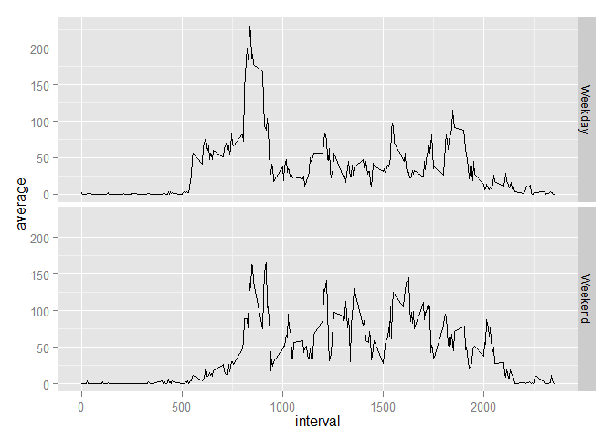

# Reproducible Research: Peer Assessment 1

This assignment makes use of data from a personal activity monitoring device. This device collects data at 5 minute intervals through out the day. The data consists of two months of data from anonymous individual collected durinng the months of October and November, 2012 and include number of steps taken in 5 minute interval each day.

## Loading and preprocessing the data

Read data to 'activity' data.frame


```r
if (!file.exists("activity.csv")) {
    unzip("activity.zip")
}
activity <- read.csv("activity.csv")
file.remove("activity.csv")
```

Verify data is read.


```r
head(activity)
```

```
##   steps       date interval
## 1    NA 2012-10-01        0
## 2    NA 2012-10-01        5
## 3    NA 2012-10-01       10
## 4    NA 2012-10-01       15
## 5    NA 2012-10-01       20
## 6    NA 2012-10-01       25
```

## What is mean total number of steps taken per day?


```r
totalSteps <- aggregate(activity$steps, list(activity$date), sum)
colnames(totalSteps) <- c("date", "steps")
hist(totalSteps$steps, main = "Histogram of total steps every day (has missing data)", xlab = "Total Steps")
```

 

```r
mean(totalSteps$steps, na.rm = T)
```

```
## [1] 10766.19
```

```r
median(totalSteps$steps, na.rm = T)
```

```
## [1] 10765
```

## What is the average daily activity pattern?


```r
avgSteps <- aggregate(activity$steps, list(activity$interval), mean, na.rm=T)
colnames(avgSteps) <- c("interval", "steps")
avgSteps[which.max( avgSteps[,2] ), 2]
```

```
## [1] 206.1698
```

```r
library(ggplot2)
g <- ggplot(avgSteps, aes(x=interval, y = steps ))
g + geom_line()
```

 

## Imputing missing values


```r
nrow(activity[is.na(activity$steps), ])
```

```
## [1] 2304
```

```r
for (i in 1:nrow(activity)) { 
    if (is.na(activity[i,"steps"])) {
        activity[i, "steps"] <- round(avgSteps[avgSteps$interval == activity[i, "interval"], 2])
    }
}
head(activity)
```

```
##   steps       date interval
## 1     2 2012-10-01        0
## 2     0 2012-10-01        5
## 3     0 2012-10-01       10
## 4     0 2012-10-01       15
## 5     0 2012-10-01       20
## 6     2 2012-10-01       25
```


```r
totalSteps <- aggregate(activity$steps, list(activity$date), sum)
colnames(totalSteps) <- c("date", "steps")
hist(totalSteps$steps, main = "Histogram of total steps every day (imputed missing data)", xlab = "Total Steps")
```

 

```r
mean(totalSteps$steps)
```

```
## [1] 10765.64
```

```r
median(totalSteps$steps)
```

```
## [1] 10762
```

## Are there differences in activity patterns between weekdays and weekends?


```r
activity$wday <- as.factor(ifelse(weekdays(as.Date(activity$date)) %in% c("Saturday","Sunday"), "Weekend", "Weekday"))
avgSteps <- aggregate(activity$steps, list(activity$wday, activity$interval), mean)
colnames(avgSteps) <- c("wdays", "interval", "average")
head(avgSteps)
```

```
##     wdays interval   average
## 1 Weekday        0 2.2888889
## 2 Weekend        0 0.2500000
## 3 Weekday        5 0.4000000
## 4 Weekend        5 0.0000000
## 5 Weekday       10 0.1555556
## 6 Weekend       10 0.0000000
```

```r
g <- ggplot(avgSteps, aes(x=interval, y = average ))
g <- g + facet_grid(wdays ~ .)
g + geom_line()
```

 
