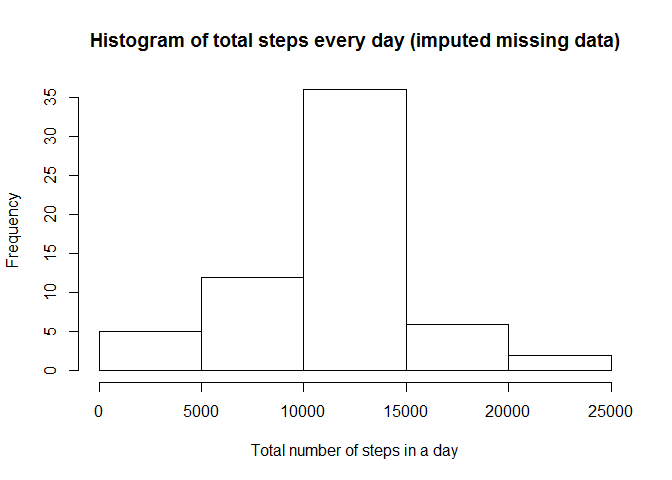

# Reproducible Research: Peer Assessment 1

This assignment makes use of data from a personal activity monitoring device. This device collects data at 5 minute intervals through out the day. The data consists of two months of data from anonymous individual collected durinng the months of October and November, 2012 and include number of steps taken in 5 minute interval each day.

## Loading and preprocessing the data

#### Read data to 'activity' data.frame


```r
if (!file.exists("activity.csv")) {
    unzip("activity.zip")
}
activity <- read.csv("activity.csv")
file.remove("activity.csv")
```

#### Verify data is read.


```r
head(activity)
```

```
##   steps       date interval
## 1    NA 2012-10-01        0
## 2    NA 2012-10-01        5
## 3    NA 2012-10-01       10
## 4    NA 2012-10-01       15
## 5    NA 2012-10-01       20
## 6    NA 2012-10-01       25
```

## What is mean total number of steps taken per day?


```r
totalSteps <- aggregate(activity$steps, list(activity$date), sum)
colnames(totalSteps) <- c("date", "steps")
hist(totalSteps$steps, main = "Histogram of total steps every day (has missing data)", xlab = "Total number of steps in a day")
```

 

#### Mean and median of total number of steps taken per day.


```r
mean(totalSteps$steps, na.rm = T)
```

```
## [1] 10766.19
```

```r
median(totalSteps$steps, na.rm = T)
```

```
## [1] 10765
```

## What is the average daily activity pattern?


```r
avgSteps <- aggregate(activity$steps, list(activity$interval), mean, na.rm=T)
colnames(avgSteps) <- c("interval", "steps")

library(ggplot2)
g <- ggplot(avgSteps, aes(x=interval, y = steps ))
g <- g + geom_line()
g <- g + labs(x = "5-minute Interval")
g <- g + labs(y = "Average number of Steps (accross all days)")
g + labs(title = "Average number of steps taken, averaged across all days")
```

 

#### Interval, on average across all the days in the dataset, that contains the maximum number of steps.


```r
avgSteps[which.max( avgSteps[,2] ), ]
```

```
##     interval    steps
## 104      835 206.1698
```

## Imputing missing values

#### Number of rows with missing data.


```r
nrow(activity[is.na(activity$steps), ])
```

```
## [1] 2304
```

#### Adding missing data.

The missing number of steps for a particular row is added based on the average for that interval accross all days. Since number of steps for each interval should be an integer, the average value is rounded to get integer value for number of steps.


```r
for (i in 1:nrow(activity)) { 
    if (is.na(activity[i,"steps"])) {
        activity[i, "steps"] <- round(avgSteps[avgSteps$interval == activity[i, "interval"], 2])
    }
}
```

#### Verify missing data imputation.


```r
head(activity)
```

```
##   steps       date interval
## 1     2 2012-10-01        0
## 2     0 2012-10-01        5
## 3     0 2012-10-01       10
## 4     0 2012-10-01       15
## 5     0 2012-10-01       20
## 6     2 2012-10-01       25
```


```r
totalSteps <- aggregate(activity$steps, list(activity$date), sum)
colnames(totalSteps) <- c("date", "steps")
hist(totalSteps$steps, main = "Histogram of total steps every day (imputed missing data)", xlab = "Total number of steps in a day")
```

 

#### Mean and median of total number of steps taken per day with missing data filled in.


```r
mean(totalSteps$steps)
```

```
## [1] 10765.64
```

```r
median(totalSteps$steps)
```

```
## [1] 10762
```

The mean and median values of total number of steps taken per day differ slightly between the data with missing values and data with missing values filled in. The scheme used for filling missing values ensures that mean should not be different. The difference we see here is due to rounding. We round the average value instead of using the actual average when filling missing values.

There are 8 days for which data for all intervals are missing. On other days all the data is present. Since we use average accross all days for a particular interval to fill missing data, the overall mean should not be different than when the data was missing. The median value in the original data was close to the mean and it remains so after the missing data is filled in.

The histogram has more data to plot after filling missing values, therefore the y-axis has higher values.

## Are there differences in activity patterns between weekdays and weekends?

#### Add a new column with factor values 'weekend' and 'weekday' to activity.
Aggregate average number of steps per interval accross all days divided between 'weekend' and 'weekdays'


```r
activity$wday <- as.factor(ifelse(weekdays(as.Date(activity$date)) %in% c("Saturday","Sunday"), "Weekend", "Weekday"))
avgSteps <- aggregate(activity$steps, list(activity$wday, activity$interval), mean)
colnames(avgSteps) <- c("wdays", "interval", "average")
```

#### Verify aggregated data with wday factor.


```r
head(avgSteps)
```

```
##     wdays interval   average
## 1 Weekday        0 2.2888889
## 2 Weekend        0 0.2500000
## 3 Weekday        5 0.4000000
## 4 Weekend        5 0.0000000
## 5 Weekday       10 0.1555556
## 6 Weekend       10 0.0000000
```


```r
g <- ggplot(avgSteps, aes(x=interval, y = average ))
g <- g + facet_grid(wdays ~ .)
g <- g + geom_line()
g <- g + labs(x = "5-minute Interval")
g <- g + labs(y = "Average number of Steps")
g + labs(title = "Average number of steps taken on weekdays and weekends")
```

 
